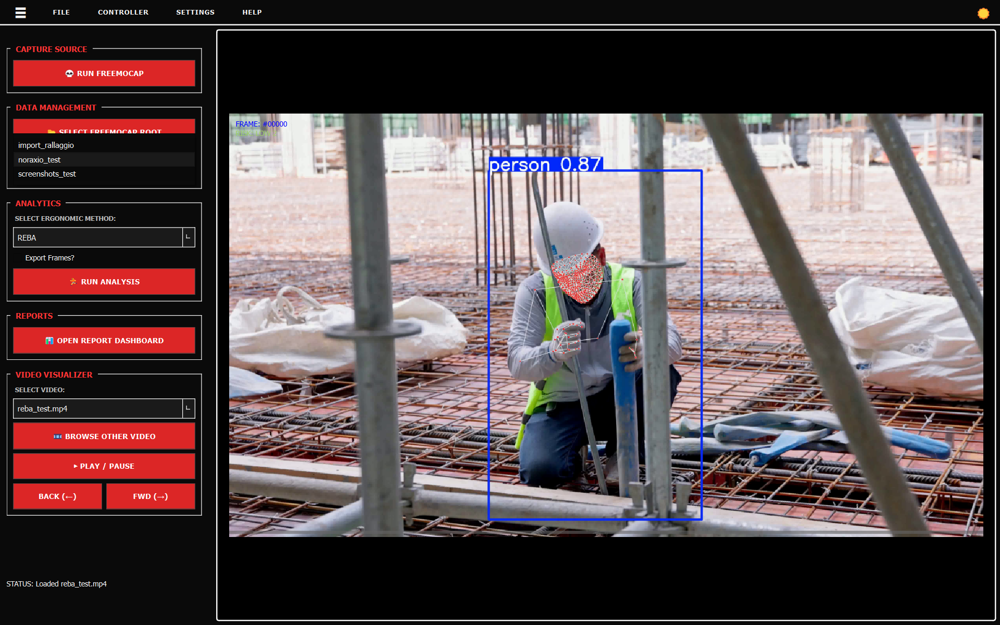
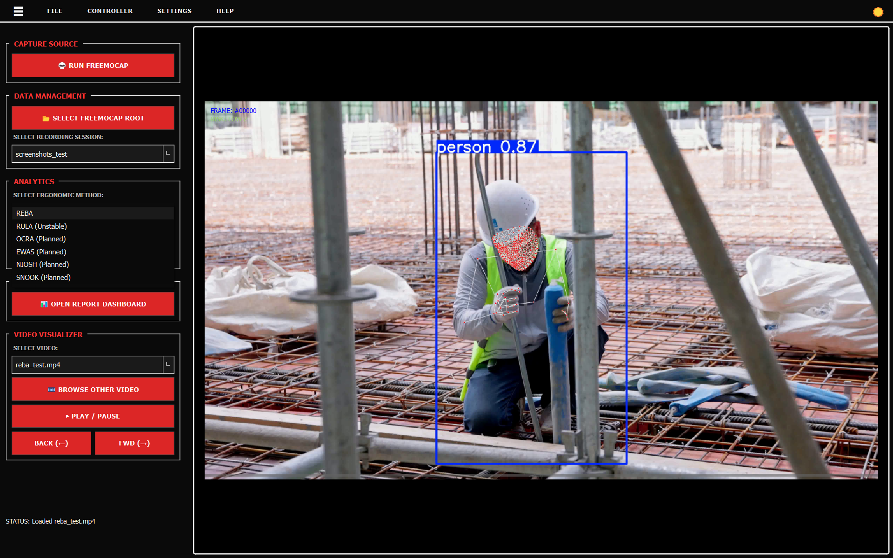
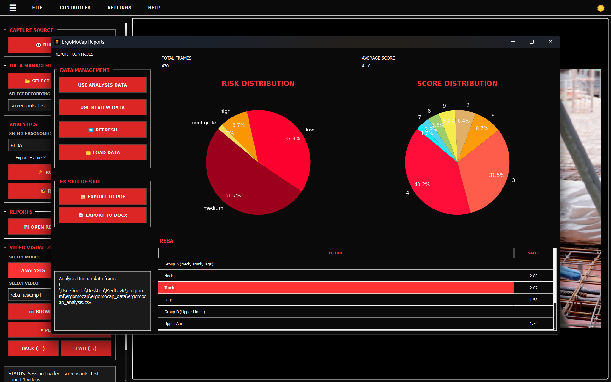
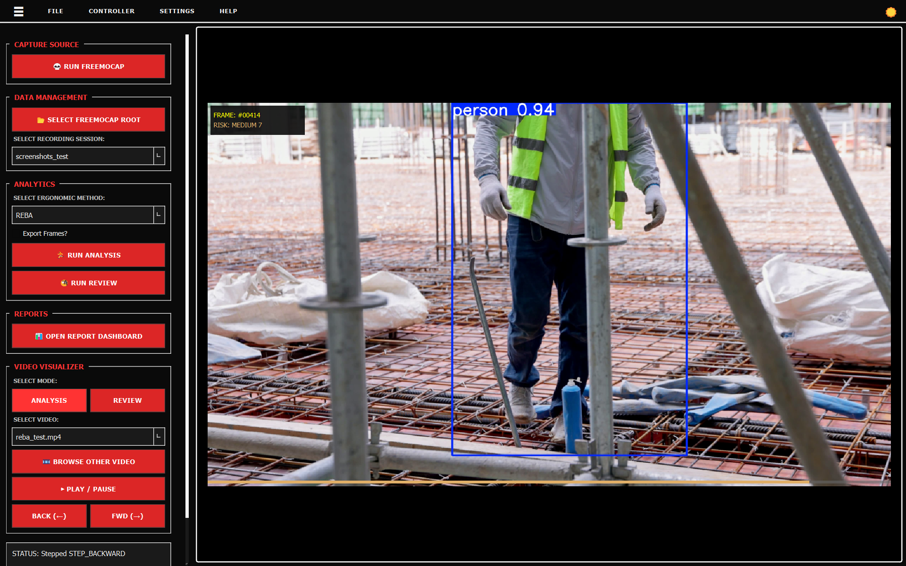
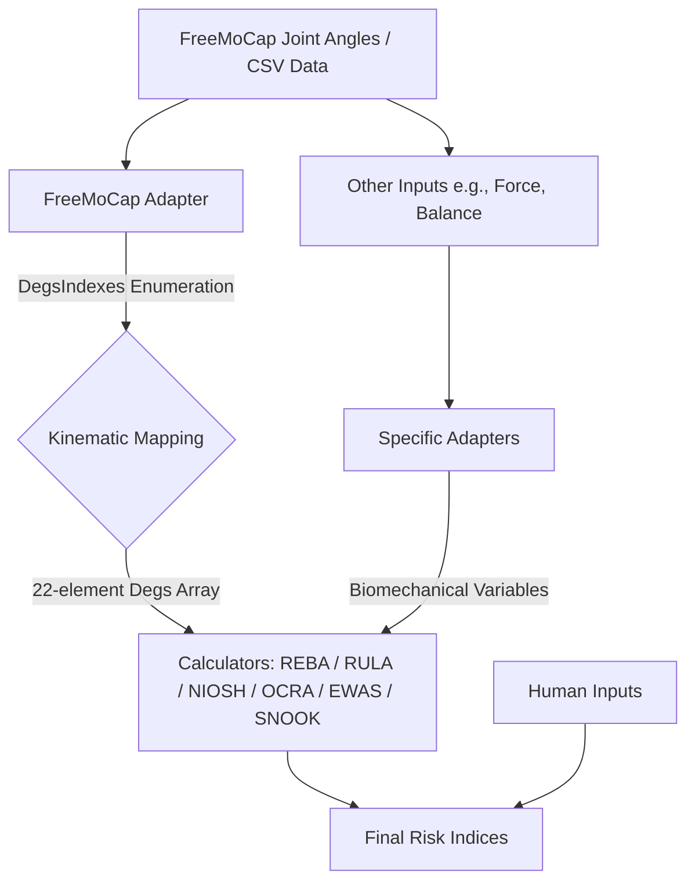

<div align="center">

  <p align="center">
    <code>DEVELOPED AND MAINTAINED BY <a href="https://medlav.app" target="_blank" rel="noopener noreferrer">MEDLAV.APP</a></code>
  </p>

  <p align="center">
    
  </p>

  <h1 align="center">ERGO<font color="red">MOCAP</font></h1>

  <p align="center">
    Powered by <strong><a href="https://freemocap.org/" target="_blank" rel="noopener noreferrer">FreeMoCap 💀</a></strong>
  </p>

  <p align="center">
    <a href="https://github.com/medlav/ergomocap/releases/latest">
      
    </a>
    <a href="https://medlav.github.io/ergomocap/">
      
    </a>
    <a href="https://medlav.github.io/ergomocap/home.html">
      
    </a>
  </p>

</div>


---

# ErgoMoCap: FOSS Ergonomics Motion Capture


[](https://github.com/medlav/ergomocap/releases/latest)


<blockquote style="border-left: 4px solid #dc2626; background-color: #f5f5f5; padding: 1.2rem 1.5rem; margin: 1.5rem 0; font-family: -apple-system, BlinkMacSystemFont, 'Segoe UI', Roboto, sans-serif; border-radius: 0 6px 6px 0;">

  <div style="display: flex; align-items: center; gap: 0.5rem; color: #dc2626; font-family: 'SFMono-Regular', Consolas, monospace; font-size: 0.85rem; font-weight: bold; letter-spacing: 1px; text-transform: uppercase; margin-bottom: 0.75rem;">
    <span>⚠️ CAUTION: ACADEMIC & RESEARCH DISCLAIMER</span>
  </div>

  <p style="margin: 0; font-size: 0.95rem; line-height: 1.6; color: #333333;">
    <strong>ErgoMoCap</strong> is a technical experiment developed exclusively as an academic instrument for research and study. It is currently in a
    <code style="background-color: #e5e5e5; padding: 2px 6px; border-radius: 4px; font-family: monospace; font-weight: bold; color: #dc2626;">PRE-ALPHA</code>
    stage, structurally experimental, and is <strong>not</strong> a certified replacement for industrial workplace safety compliance software. It must not be used as an official reporting system without independent, professional verification.
  </p>

</blockquote>

ErgoMoCap is an academic application developed for ergonomics study and biomechanical research. It runs locally as a Python desktop application.

ErgoMoCap is **Free and Open Source Software (FOSS)**.

It processes motion capture tracking data to execute standardized ergonomic risk assessments as an open-source alternative to commercial software suites.

This project is licensed under the **AGPL-3.0**. You are permitted to use, modify, and distribute the software under the condition that all modifications remain under the same license terms.

**Network Users:** If you host a modified version of ErgoMoCap as a network service, you are required to make the modified source code available for download to your users per Section 13 of the license.

### System Functionality
The application functions as a graphical interface wrapper. It executes a system call to launch **FreeMoCap** in an isolated process to handle data recording.

Following data collection, the backend processes the coordinate maps, performs ergonomic calculations, and generates diagnostic reports.

All data processing occurs on the user's local machine to comply with privacy and research data tracking protocols.

For layout overviews, implementation details, and step-by-step guides, refer to the [**Visual Docs**](https://medlav.github.io/ergomocap/) or the [**API Reference**](https://medlav.github.io/ergomocap/home.html).

## Table of Content

0. [Introduction](#ergomocap-foss-ergonomics-motion-capture)
1. [Screenshots](#screenshots)
2. [Technical Implementation & Pipeline](#technical-implementation--pipeline)
3. [Project Structure](#project-structure)
4. [Installation & Local Setup](#installation--local-execution)
5. [Quality Assurance & Automated Auditing](#quality-assurance--automated-auditing)
6. [Long-Term Plan](#long-term-integration-strategy)
7. [Operational Constraints & Compliance](#operational-constraints--compliance)
8. [License](#license)

## Screenshots

| **Step-by-Step App Walkthrough** |
| :---: |
| **Step 1: Recording Selection**<br><br> |
| **Step 2: Video Selection & Tracking**<br><br> |
| **Step 3: Assessment Method Selection (REBA/RULA)**<br><br> |
| **Step 4: Asynchronous Engine Analysis**<br><br> |
| **Step 5: Media Playback & Video Controls**<br><br> |
| **Step 6: Statistical Distribution Dashboard**<br><br> |

## Technical Implementation & Pipeline

The data pipeline separates data acquisition from the mathematical scoring engines.

1. **Acquisition:** The interface acts as an asynchronous process wrapper, launching FreeMoCap via system calls to manage recording sessions and track initial kinematic coordinates.
2. **Ingestion:** The backend parses the landmark and angular tracking files (`joint_angles.csv`) using data translation adapters.
3. **Calculation:** Core evaluation modules (REBA/RULA) use **Numba JIT compilation** and **vectorized NumPy lookups** to process incoming telemetry frames at runtime.



## Project Structure

The codebase separates concerns by decoupling mathematical logic from the PyQt6 layer and background I/O operations.

```text
ergomocap/
├── main.py                     # Application entry point
├── requirements.txt            # Package dependencies
├── calculators/                # Biomechanical Scoring Engine
│   ├── calculators.py          # Package Facade and API exposure layer
│   ├── adapters/               # Data transformation and input normalization
│   │   ├── force_adapter.py    # Formats external loads and weight vectors
│   │   └── freemocap_adapter.py# Parses joint_angles.csv and maps DegsIndexes
│   ├── calculators_utils/      # Shared mathematical helpers and constants
│   ├── ewas_calculator/        # EWAS Standard implementation
│   ├── niosh_calculator/       # RNLE Lifting Equation engine
│   ├── ocra_calculator/        # Repetitive Task Analysis engine
│   ├── snook_calculator/       # Snook & Ciriello Tables module
│   ├── reba_calculator/        # Rapid Entire Body Assessment package
│   │   ├── REBA_calculator.py  # REBA orchestration engine
│   │   └── body_parts/         # Segment penalty sub-modules
│   └── rula_calculator/        # Rapid Upper Limb Assessment package
│       ├── RULA_calculator.py  # RULA orchestration engine
│       └── rula_body_parts.py  # Segment penalty sub-modules
├── gui/                        # PyQt6 Desktop Application (MVP Pattern)
│   ├── frontend.py             # MainWindow layout definitions
│   ├── backend/                # Presenters: UI state management & worker lifecycles
│   │   ├── backend.py          # ErgoBackend: Presenter for MainWindow
│   │   └── report_backend.py   # ReportBackend: Presenter for ReportView
│   ├── core/                   # Domain Layer: Core business logic
│   │   ├── analysis_engine.py  # Engine executing ergonomic calculations
│   │   ├── calculators_adapter.py# Data structural formatting for REBA/RULA strategies
│   │   ├── report_strategies.py# Document generation and layout templates
│   │   └── session_manager.py  # Session tracking and data file synchronization
│   ├── templates/              # Layout definitions (Jinja2 & DOCX templates)
│   ├── theme/                  # Styling: Centralized QSS stylesheets (style.py)
│   ├── utils/                  # UI/Presenter shared configurations
│   │   ├── app_paths.py        # ErgoPaths: File and directory path registry
│   │   ├── constants.py        # Global constants and system Enums
│   │   └── models.py           # Data models for Signal/Slot operations
│   └── workers/                # Concurrency Layer: Background QThread tasks
│       ├── frames_export_worker.py # Asynchronous file I/O operations
│       └── video_worker.py     # Asynchronous frame decoding and playback tracking
├── intl/                       # i18n Translation files (Italian localization)
├── tests/                      # Mirror-Tree Test Suite
│   ├── calculators/            # Mathematical evaluation tests
│   ├── gui/                    # View, presenter, and interaction tests
│   └── e2e/                    # Complete data pipeline integration validation
└── freemocap_data/             # Recording data files [Git-ignored]

```

## Installation & Local Execution

### Prerequisites

* Python 3.12.x
* FreeMoCap local installation configured and accessible via system path

### Setup Steps

1. **Clone the repository:**

```bash
git clone [https://github.com/medlav/ergomocap.git](https://github.com/medlav/ergomocap.git)
cd ergomocap

```

2. **Install dependencies:**

```bash
pip install -r requirements.txt

```

3. **Register pre-commit validation hooks:**

```bash
pre-commit install

```

4. **Launch the application:**

```bash
python main.py

```

## Quality Assurance & Automated Auditing

To verify calculator output accuracy, the codebase uses local verification hooks and remote continuous integration pipelines.

### Verification Protocol Workflow

Audit tools can be executed manually to inspect system components, code safety metrics, and coverage:

| Command Execution | Operational Objective |
| --- | --- |
| `pytest` | Runs the test suite. |
| `pytest -v` | Runs tests with detailed execution logging per module. |
| `pytest --cov=calculators` | Calculates test coverage metrics for target core engines. |
| `bandit -c pyproject.toml -r .` | Scans files for security vulnerabilities via the TOML parameters. |
| `pydoclint .` | Validates docstring formatting against function structural footprints. |
| `pip-licenses --format=markdown --output-file=CREDITS.md` | Compiles dependency licenses into a markdown reference sheet. |
| `ruff check --fix .` | Lints target workspace directories and resolves minor issues. |
| `ruff format .` | Normalizes codebase text presentation layouts to match repository styles. |
| `interrogate -v --generate-badge assets .` | Measures documentation coverage and updates the visual status badge. |
| `pytest --cov=calculators --cov=gui --cov-report=xml` | Generates a standard XML coverage document for automated CI pipelines. |
| `pytest --cov=calculators --cov=gui --cov-report=term-missing` | Evaluates target files and highlights unexecuted code blocks. |
| `anybadge --label=tests --value=passing --file=assets/tests_badge.svg --overwrite` | Exports a static SVG status asset indicating passing test operations. |
| `coverage-badge -f -o assets/coverage.svg` | Updates the coverage visualization graphic using current test statistics. |
| `python scripts/todo_scanner.py` | Indexes remaining code markers and compiles tasks into `TODO.md`. |
| `pre-commit run mkdocs-build --all-files` | Evaluates API files and renders technical documentation sheets via mkdocs. |
| `pre-commit run --all-files` | Runs the complete suite of hooks across all repository tracking targets. |

### Pre-commit Hook Isolation

Using `pre-commit` matches local tests with the configurations applied inside continuous integration pipelines.

```bash
# Run a specific verification engine against tracking targets
pre-commit run <hook_id> --all-files

```

| Target Hook ID | Operational Goal |
| --- | --- |
| `bandit` | Code security vulnerability evaluation. |
| `ruff` | Syntax optimization and layout auditing. |
| `ruff-format` | Automated code layout configuration management. |
| `doc-coverage` | Technical metadata and docstring metric evaluation. |
| `pytest-run` | Execution runner for system checking operations. |
| `generate-todo-list` | Extracts inline program flags into a unified document structure. |

#### Pre-commit CLI Command Table

| Target Hook | CLI Command | Purpose |
| --- | --- | --- |
| **Full Suite** | `pre-commit run --all-files` | Runs all configured validation steps across the codebase. |
| **Security** | `pre-commit run bandit --all-files` | Executes vulnerability checking via pyproject parameters. |
| **Linting** | `pre-commit run ruff --all-files` | Audits system logic and applies architectural fixes. |
| **Formatting** | `pre-commit run ruff-format --all-files` | Validates layout and text presentation structures. |
| **Doc Coverage** | `pre-commit run doc-coverage --all-files` | Refreshes inline reference documentation percentages. |
| **Unit Tests** | `pre-commit run pytest-run --all-files` | Runs tests and records output analytics logs. |
| **Test Badge** | `pre-commit run tests-badge --all-files` | Re-compiles the current test engine results asset. |
| **Cov Badge** | `pre-commit run coverage-badge --all-files` | Updates the status indicator tracking current test coverage. |
| **TODO Scan** | `pre-commit run generate-todo-list --all-files` | Triggers the local task scanning script. |

**Operational Note:** Omit the `--all-files` parameter to isolate validation scripts exclusively to modified files currently in the staging area.

## Long-Term Integration Strategy

This project operates as an multi-phase academic codebase. The primary technical objective is to validate the calculators in real-world settings, after having the software released in a stable, audited usable version.

Future iterations will natively embed tracking frameworks to create a standalone application for ergonomics analysis. This combines data collection and evaluation operations into a unified application architecture for industrial and academic workloads.

## License

Distributed under the **GNU Affero General Public License v3.0 (AGPL-3.0)**.

* **Copyleft Requirement:** Modifying this source code requires you to make your adjustments transparent and distributed under matching AGPL-3.0 tracking definitions.
* **Network Deployment:** Running an updated deployment variant over standard data servers requires providing users with access to download the corresponding engineering updates without transactional fees.

[Review Full AGPL-3.0 Legal Terms](https://www.gnu.org/licenses/agpl-3.0.en.html)

Developed and maintained by **medlav**.

---

© 2026 medlav. Distributed under the **GNU Affero General Public License v3.0 (AGPL-3.0)**.

