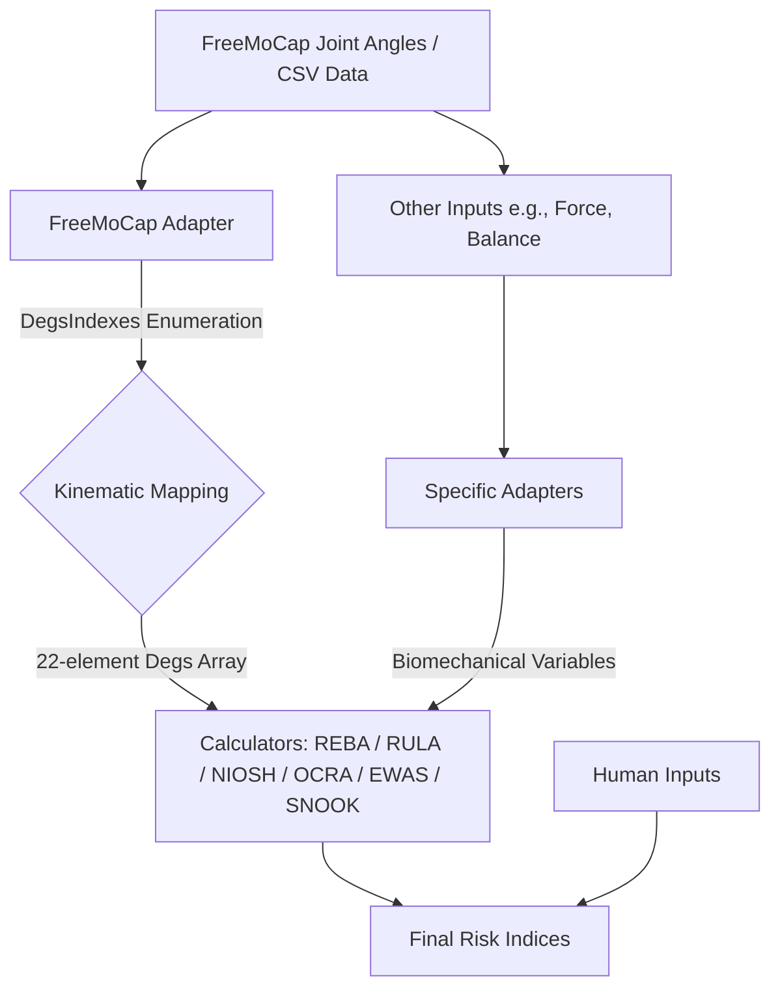

# ErgoMoCap Calculators Module

## Technical Design & API Documentation

The ErgoMoCap `calculators` module processes spatial tracking data and joint angles from FreeMoCap pipelines into ergonomic risk scores. The engine uses data adapters, modular assessment sub-packages, and fixed kinematic mappings to evaluate poses against standard ergonomic assessment methods (REBA, RULA, NIOSH, OCRA, EWAS, and Snook).

## 1. System Architecture

The package separates the acquisition of coordinate/joint data from the execution of ergonomic scoring rules. It accepts tracking data (such as FreeMoCap's exported `joint_angles.csv`) and maps those variables to standard matrices.



### Data Pipeline Steps

1. **Data Ingestion:** Reads angular and landmark data exported from the tracking source (`joint_angles.csv`).
2. **Kinematic Mapping:** Maps raw coordinates/angles using index enumerations (`DegsIndexes`) to build a uniform 22-element input vector.
3. **Segmentation & Factor Extraction:** Groups inputs by body regions (Group A: Upper/Lower Arm, Wrist; Group B: Neck, Trunk, Legs) or extracts external constraints using dedicated adapters (e.g., `force_adapter.py`).
4. **Postural Evaluation:** Passes the mapped vectors to individual calculation rules to compute specific segment penalty scores.
5. **Synthesis:** Looks up intermediate group scores in cross-reference tables to generate final risk indices.

---

## 2. Core API Reference

### 2.1 REBA Calculator

`REBA_calculator.py`

Processes skeletal joint angles to calculate frame-by-frame Rapid Entire Body Assessment (REBA) risk scores. Calculations are divided into **Group A** (Trunk, Neck, Legs) and **Group B** (Upper Arm, Lower Arm, Wrist).

* **Primary Function:** `calculate_frame_reba_from_degs(degs)`

| Parameter | Type | Description |
| --- | --- | --- |
| `degs` | `NDArray[np.float64]` | A 1D array containing exactly 22 values mapped to `DegsIndexes`. |

#### Return Value

Returns a `tuple[dict[str, int], dict[str, Any]]`:

1. **`final_scores`**: A dictionary containing calculated segment scores, intermediate table scores, and the final index:
* `"Legs_Score_REBA"`: Integer score for the leg segment.
* `"Trunk_Score_REBA"`: Integer score for the trunk segment.
* `"Neck_Score_REBA"`: Integer score for the neck segment.
* `"Upper_Arm_Score_REBA"`: Integer score for the upper arm segment.
* `"Lower_Arm_Score_REBA"`: Integer score for the lower arm segment.
* `"Wrist_Score_REBA"`: Integer score for the wrist segment.
* `"Score_A_REBA"`: Intermediate Group A score adjusted for loads.
* `"Score_B_REBA"`: Intermediate Group B score adjusted for coupling.
* `"Score_C_REBA"`: Combined score from Table C lookup.
* `"Final_Score_REBA"`: The final index combining Score C and activity modifiers.


2. **`degrees_map`**: Empty dictionary `{}` (maintained for API consistency).

#### Vector Mapping & Slice Ranges (`degs` via `DegsIndexes` / `DI`):

Slices use explicit `[START : END + 1]` indices to prevent out-of-bounds errors when querying mapped data:

* **`[0:2]` Legs:** `degs[DI.RIGHT_KNEE_EXTENSION_FLEXION : DI.LEFT_KNEE_EXTENSION_FLEXION + 1]`
* Evaluates knee flexion/extension. Calls `leg_reba_score`.


* **`[2:5]` Trunk:** `degs[DI.SPINE_EXTENSION_FLEXION : DI.SPINE_ROTATION_TORSION + 1]`
* Evaluates trunk extension/flexion, lateral flexion, and torsion. Calls `trunk_reba_score`.


* **`[5:8]` Neck:** `degs[DI.NECK_EXTENSION_FLEXION : DI.NECK_ROTATION + 1]`
* Evaluates neck extension/flexion, lateral flexion, and rotation. Calls `neck_reba_score`.


* **`[8:14]` Upper Arm:** `degs[DI.RIGHT_SHOULDER_EXTENSION_FLEXION : DI.LEFT_SHOULDER_RISE + 1]`
* Evaluates shoulder extension/flexion, abduction/adduction, and elevation. Calls `upper_arm_reba_score`.


* **`[14:16]` Lower Arm:** `degs[DI.RIGHT_ELBOW_EXTENSION_FLEXION : DI.LEFT_ELBOW_EXTENSION_FLEXION + 1]`
* Evaluates elbow extension/flexion. Calls `lower_arm_reba_score`.


* **`[16:22]` Wrist:** `degs[DI.RIGHT_HAND_EXTENSION_FLEXION : DI.LEFT_HAND_TWIST + 1]`
* Evaluates wrist extension/flexion, lateral deviation, and twist. Calls `wrist_reba_score`.


#### Internal Functions & Matrix Lookups:

* **`get_score_a(trunk: int, neck: int, legs: int) -> int`**
* Looks up data in `_TABLE_A_DATA`.
* Clamps inputs to safe ranges: Trunk `[1, 5]`, Neck `[1, 3]`, Legs `[1, 4]`.
* Converts float inputs to integers to ensure matrix index compatibility.


* **`get_score_b(upper_arm: int, lower_arm: int, wrist: int) -> int`**
* Looks up data in `_TABLE_B_DATA`.
* Clamps inputs to safe ranges: Upper Arm `[1, 6]`, Lower Arm `[1, 2]`, Wrist `[1, 3]`.


* **`get_final_reba(score_a: int, score_b: int, load: int = 0, activity: int = 0) -> int`**
* Cross-references Score A and Score B using `_TABLE_C_DATA`.
* Adds external modifiers (load weight and activity stability parameters) to compute the final value.


---

### 2.2 RULA Calculator

`RULA_calculator.py`

Calculates upper limb postural and repetitive action risks per frame. Divides analysis into Group A (Upper Arm, Lower Arm, Wrist, Wrist Twist) and Group B (Neck, Trunk, Legs).

* **Primary Function:** `calculate_frame_rula_from_degs(degs, muscle_score=0, force_score=0, is_arm_supported=False, are_legs_unsupported=False)`

| Parameter | Type | Default | Description |
| --- | --- | --- | --- |
| `degs` | `NDArray[np.float64]` | *Required* | A 1D array of exactly 22 joint values mapped using `DegsIndexes`. |
| `muscle_score` | `int` | `0` | Penalty score for static postures or repetitions (0 or 1). |
| `force_score` | `int` | `0` | Penalty score for external loads (0, 1, 2, or 3). |
| `is_arm_supported` | `bool` | `False` | Flag that decreases upper arm penalty if supports are detected. |
| `are_legs_unsupported` | `bool` | `False` | Flag that increases Group B leg score if lower limbs lack support. |

#### Return Value

Returns a `tuple[dict[str, int], dict[str, Any]]`:

1. **`final_scores`**: A dictionary containing calculated raw scores, subgroup scores, and the final RULA risk index:
* `"Upper_Arm_Score_RULA"`: Calculated score for the upper arm.
* `"Lower_Arm_Score_RULA"`: Calculated score for the lower arm.
* `"Trunk_Score_RULA"`: Calculated score for the trunk.
* `"Neck_Score_RULA"`: Calculated score for the neck.
* `"Wrist_Score_RULA"`: Calculated score for the wrist.
* `"Score_A_RULA"`: Group A score adjusted for muscle and force variables.
* `"Score_B_RULA"`: Group B score adjusted for muscle and force variables.
* `"Final_Score_RULA"`: Final evaluation index from Table C lookup.


2. **`metadata`**: Empty dictionary `{}` (maintained for API consistency).

#### Vector Mapping & Index Extractions (`degs` via `DegsIndexes` / `DI`):


RULA selects specific indices from the 22-element vector (Group A elements map to the right side of the body by default):

* **Group A: Upper Limb**
* **Upper Arm:** Derived from `degs[DI.RIGHT_SHOULDER_EXTENSION_FLEXION]`, `degs[DI.RIGHT_SHOULDER_ABDUCTION_ADDUCTION]`, and `degs[DI.RIGHT_SHOULDER_RISE]`. Passed to `upper_arm_rula_score`.
* **Lower Arm:** Derived from `degs[DI.RIGHT_ELBOW_EXTENSION_FLEXION]`. Passed to `lower_arm_rula_score`.
* **Wrist:** Derived from `degs[DI.RIGHT_HAND_EXTENSION_FLEXION]` and `degs[DI.RIGHT_HAND_LATERAL_SIDE]`. Passed to `wrist_rula_score`.
* **Wrist Twist:** Derived from `degs[DI.RIGHT_HAND_TWIST]`. Passed to `wrist_twist_rula_score` (applies a penalty if twist exceeds 40 degrees).


* **Group B: Neck, Trunk, Legs**
* **Neck:** Derived from `degs[DI.NECK_EXTENSION_FLEXION]`, `degs[DI.NECK_LATERAL_FLEXION]`, and `degs[DI.NECK_ROTATION]`. Passed to `neck_rula_score`.
* **Trunk:** Derived from `degs[DI.SPINE_EXTENSION_FLEXION]`, `degs[DI.SPINE_LATERAL_FLEXION]`, and `degs[DI.SPINE_ROTATION_TORSION]`. Passed to `trunk_rula_score`.
* **Legs:** Evaluated via input arguments; returns 2 if `are_legs_unsupported` is `True`, otherwise defaults to 1.


#### Sub-Score Processing & Table Lookups:

* **Group A Sub-Score Synthesis:**
* Uses `upper_arm_score`, `lower_arm_score`, `wrist_score`, and `wrist_twist_score` to look up the raw value in `_TABLE_A_DATA` using 0-based indexing (`score - 1`).
* `grand_score_a` is calculated by adding `muscle_score` and `force_score` to the lookup result, then clamped to a `[1, 8]` interval:


$$\text{grand\_score\_a} = \max(1, \min(\text{score\_a\_raw} + \text{muscle\_score} + \text{force\_score}, 8))$$

* **Group B Sub-Score Synthesis:**
* Uses `neck_score`, `trunk_score`, and `legs_score` to look up the raw value in `_TABLE_B_DATA` using 0-based indexing.
* `grand_score_b` is calculated by adding `muscle_score` and `force_score` to the lookup result, then clamped to a `[1, 7]` interval:


$$\text{grand\_score\_b} = \max(1, \min(\text{score\_b\_raw} + \text{muscle\_score} + \text{force\_score}, 7))$$

* **Final Score Synthesis (Table C):**
* Maps `grand_score_a` and `grand_score_b` to `_TABLE_C_DATA` using 0-based offsets (`grand_score_a - 1`, `grand_score_b - 1`) to return the final integer `final_rula` index.


---

## 3. Implementation Status

Calculators are organized into individual modules. Unimplemented modules return placeholder values to prevent integration breakages during development.

| Standard / Calculator | Target Module | Status | Core Functions |
| --- | --- | --- | --- |
| **REBA** | `REBA_calculator.py` | Complete | `calculate_frame_reba_from_degs` |
| **RULA** | `RULA_calculator.py` | Complete | `calculate_frame_rula_from_degs` |
| **NIOSH** | `NIOSH_calculator.py` | Pending (Placeholder) | `calculate_frame_niosh_li` |
| **OCRA** | `OCRA_calculator.py` | Pending (Placeholder) | `calculate_frame_ocra_index` |
| **EWAS** | `EWAS_calculator.py` | Pending (Placeholder) | `calculate_frame_ewas_score` |
| **SNOOK** | `SNOOK_calculator.py` | Pending (Placeholder) | `calculate_frame_snook_index` |

---

## 4. Technical Details & Performance Optimization

### Vectorization & JIT Compilation Strategy

To manage execution overhead from nested conditional checks, the module utilizes the following strategies:

* **NumPy Vectorization:** Nested conditional checks are replaced with flat lookup operations using NumPy arrays for all scoring tables.
* **Numba Integration:** Core math functions are written to compile under Numba’s `@njit` (No-Python mode) runtime.
* **Current Status (JIT Disabled):** To simplify debugging and testing, `@njit` decorators are currently commented out (`# from numba import njit TODO test numba and activate`). These will be re-enabled once core data orchestration interfaces are finalized.

---

## 5. Project Structure

The codebase isolates components by task and calculation domain.

```
└── 📁calculators
    ├── 📁adapters                   # Data transformations
    │   ├── __init__.py
    │   ├── force_adapter.py         # Formats weight, forces, and load vectors
    │   ├── freemocap_adapter.py     # Parses joint_angles.csv and maps DegsIndexes
    │   └── ...                      # Planned updates (e.g., balance_adapter.py)
    ├── 📁calculators_utils          # Shared mathematical and conversion utilities
    │   ├── __init__.py
    │   ├── constants.py             # Shared ergonomics boundaries and indexes
    │   ├── conversion_utils.py      # Rotations, trigonometry, and array utilities
    │   └── ...
    ├── 📁ewas_calculator            # Ergonomic Assessment Work Sheet (EWAS)
    │   ├── __init__.py
    │   └── EWAS_calculator.py
    ├── 📁niosh_calculator           # NIOSH Lifting Equation Module
    │   ├── __init__.py
    │   └── NIOSH_calculator.py
    ├── 📁ocra_calculator            # Occupational Repetitive Actions index
    │   ├── __init__.py
    │   └── OCRA_calculator.py
    ├── 📁reba_calculator            # Postural Analysis (REBA)
    │   ├── 📁body_parts             # Segment-specific subroutines
    │   │   ├── __init__.py
    │   │   ├── leg_reba.py
    │   │   ├── lower_arm_reba.py
    │   │   ├── neck_reba.py
    │   │   ├── trunk_reba.py
    │   │   ├── upper_arm_reba.py
    │   │   └── wrist_reba.py
    │   ├── __init__.py
    │   ├── REBA_calculator.py
    │   └── reba_score_tables.py
    ├── 📁rula_calculator            # Upper Limb Analysis (RULA)
    │   ├── __init__.py
    │   ├── rula_body_parts.py       # Segment calculations for limbs
    │   ├── RULA_calculator.py
    │   └── rula_score_tables.py
    ├── 📁snook_calculator           # Snook & Ciriello Tables
    │   ├── __init__.py
    │   └── SNOOK_calculator.py
    ├── __init__.py                  # Package level exports
    └── calculators.py               # Package Facade Interface

```

---

## 6. Integration & The Facade Layer

The entry interface uses a Facade Pattern within `calculators.py` to compile sub-modules, expose static types, and support editor auto-completion.

### `calculators/calculators.py`

```python
# ---
# project: ErgoMoCap
# file: calculators.py
# author: medlav
# created: 2026-05-19
# license: AGPL-3.0
# ---
# Copyright (C) 2026 medlav

from calculators.adapters.freemocap_adapter import (
    map_fmc_joint_angles_to_ergo_degs,
    map_fmc_kinematics_to_niosh_vars,
    map_fmc_kinematics_to_ocra_vars,
    map_fmc_kinematics_to_ewas_vars,
    map_fmc_kinematics_to_snook_vars,
)

# 2. Import from the specific calculators
from calculators.reba_calculator.REBA_calculator import calculate_frame_reba_from_degs
from calculators.rula_calculator.RULA_calculator import calculate_frame_rula_from_degs
from calculators.niosh_calculator.NIOSH_calculator import (
    calculate_frame_niosh_li,
)  # TODO all niosh_calculator/ code and relative adapter/ is to be done
from calculators.ocra_calculator.OCRA_calculator import (
    calculate_frame_ocra_index,
)  # TODO all ocra_calculator/ code and relative adapter/ is to be done
from calculators.ewas_calculator.EWAS_calculator import (
    calculate_frame_ewas_score,
)  # TODO all ewas_calculator/ code and relative adapter/ is to be done
from calculators.snook_calculator.SNOOK_calculator import (
    calculate_frame_snook_index,
)  # TODO all snook_calculator/ code and relative adapter/ is to be done


# 3. Define __all__ to control what is exported and help Pylance/Intellisense
__all__ = [
    "map_fmc_joint_angles_to_ergo_degs",
    "map_fmc_kinematics_to_niosh_vars",  # TODO all niosh_calculator/ code and relative adapter/ is to be done
    "map_fmc_kinematics_to_ocra_vars",  # TODO all ocra_calculator/ code and relative adapter/ is to be done
    "map_fmc_kinematics_to_ewas_vars",  # TODO all ewas_calculator/ code and relative adapter/ is to be done
    "map_fmc_kinematics_to_snook_vars",  # TODO all snook_calculator/ code and relative adapter/ is to be done
    "calculate_frame_reba_from_degs",
    "calculate_frame_rula_from_degs",
    "calculate_frame_niosh_li",  # TODO all niosh_calculator/ code and relative adapter/ is to be done
    "calculate_frame_ocra_index",  # TODO all ocra_calculator/ code and relative adapter/ is to be done
    "calculate_frame_ewas_score",  # TODO all ewas_calculator/ code and relative adapter/ is to be done
    "calculate_frame_snook_index",  # TODO all snook_calculator/ code and relative adapter/ is to be done
]

```

---

## 7. Adapter & Domain Decomposition

The module uses separate data adapters to map spatial coordinate files into uniform parameters:

* **`freemocap_adapter.py`**: Ingests joint positions, calculates joint/plane offsets (such as sagittal plane asymmetry), and generates configuration tracking states via the `DegsIndexes` enumeration.
* **`force_adapter.py`**: Combines physical workspace parameters (such as weight loads) with spatial frame logs.
* **Future Adapters (e.g., balance, cycle metrics)**: Appends additional data tracking vectors (e.g., balance metrics) to the spatial datasets.

---

## 8. Usage Example

```python
import numpy as np
from calculators import (
    map_fmc_joint_angles_to_ergo_degs,
    calculate_frame_reba_from_degs
)

# 1. Generate an array matching tracking source output specifications
raw_fmc_joint_data = np.random.rand(30)

# 2. Re-map data points into the 22-element input array configuration
ergo_degs = map_fmc_joint_angles_to_ergo_degs(raw_fmc_joint_data)

# 3. Execute processing frame
final_reba_scores, _ = calculate_frame_reba_from_degs(ergo_degs)
print(f"Frame REBA Score: {final_reba_scores['Final_Score_REBA']}")

```

---

## 9. Structural Constraints & Edge Cases

* **Array Length Enforcement:** Calculation components require exact input array lengths. The 22-element spatial arrays mapped using `DegsIndexes` must be fully populated and cannot contain null values.
* **Sampling Rate Synchronization:** * **Sampling Rate Synchronization:** When tracking coordinates and external structural metrics (from `force_adapter.py`) use different data collection frequencies, data adapters must re-align frames to identical timestamps before scoring calculations execute.


---

## 10. Developer Guide: Adding a New Calculator

To implement a new ergonomic rule or scoring engine variant:

### 1. Directory Setup

Initialize a sub-directory within the `/calculators` path containing:

* `__init__.py`: Package entry file.
* `[Name]_calculator.py`: Core processing routines configured for execution with NumPy structures.

### 2. Adapter Creation

Write corresponding data transformation code inside `calculators/adapters` to map source coordinates to the target array indexes required by the new standard.

### 3. Facade Registration

Expose internal calculator functions and data formatting modules inside `calculators/calculators.py` by adding references explicitly to the module's `__all__` array to maintain strict export definitions.

---

## 11. License

This project is licensed under the **GNU Affero General Public License v3.0 (AGPL-3.0)**.

```
This program is free software: you can redistribute it and/or modify
it under the terms of the GNU Affero General Public License as published by
the Free Software Foundation, either version 3 of the License, or
(at your option) any later version.

```

*Copyright (C) 2026 medlav*