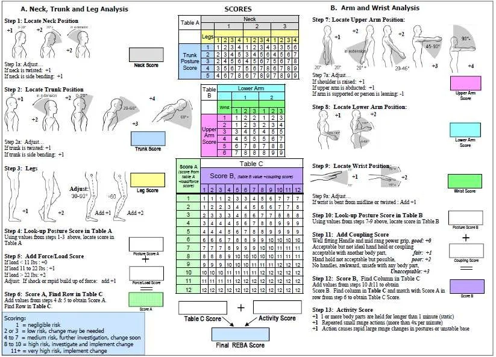

# Module Info: REBA Calculator

Rapid entire body assessment (REBA)

## Technical Specification

**S Hignett 1, L McAtamney**

PMID: 10711982 DOI: [Study](https://doi.org/10.1016/s0003-6870(99)00039-3)

## Implemented System Architecture
This is the first method implemented, this calculator exposes a standardized execution interface identical to the core evaluation classes to maintain compatibility with the gui module. Look at the GUI documentation for more details about the architecture.

---
*For development timelines and feature tracking, please refer to the global project roadmap.*