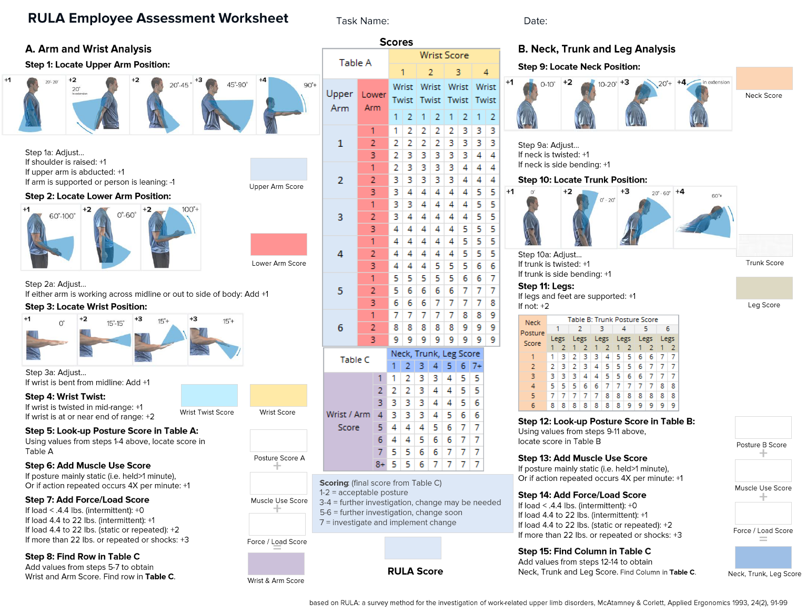

# Module Info: RULA Calculator

## Technical Specification

RULA: a survey method for the investigation of work-related upper limb disorders
**L McAtamney 1, E Nigel Corlett**

PMID: 15676903 DOI: 10.1016/0003-6870(93)90080-s

## Planned System Architecture
Once implemented, this calculator must expose a standardized execution interface identical to the core evaluation classes to maintain compatibility with the gui module.

---
*For development timelines and feature tracking, please refer to the global project roadmap.*