# ErgoMoCap and FreeMoCap Integration Tutorial

This guide provides step-by-step instructions for launching FreeMoCap within ErgoMoCap, configuring your data directories, and importing video files for processing.

## Step 1: Launching FreeMoCap

1. Locate the **Capture Source** section on the left-hand **Sidebar** of the ErgoMoCap interface.
2. Click the red **💀 RUN FREEMOCAP** button.

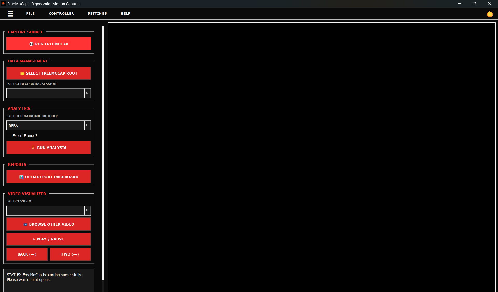

> **Important:** FreeMoCap is a resource-intensive application and can be slow to initialize. Expect a delay of at least 5 to 15 seconds for the program to load. Do not close ErgoMoCap or click the button multiple times while the initialization is in progress.

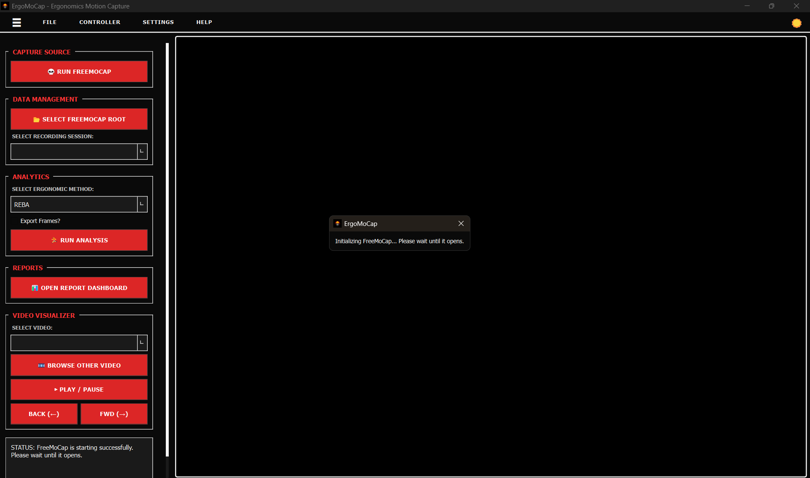

### Window Management

*Screenshot of FreeMoCap open and ErgoMoCap behind open in full-screen*

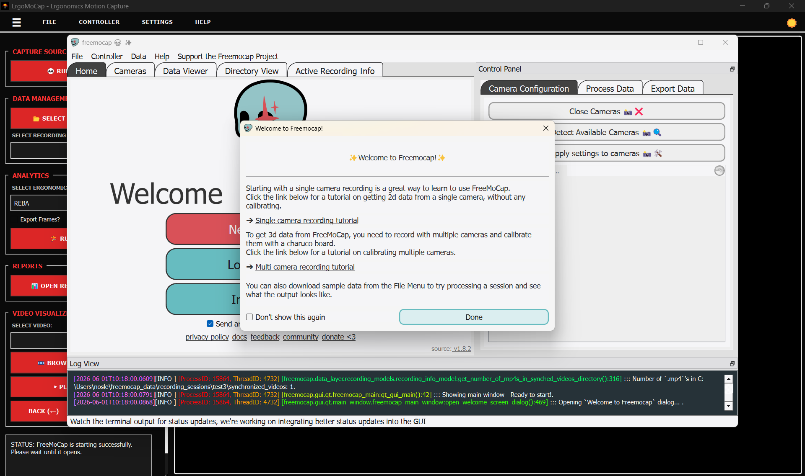

FreeMoCap launches as a separate process and window. If the FreeMoCap interface does not automatically appear on top of ErgoMoCap:

* Check your Windows taskbar.
* Click on the FreeMoCap icon to bring its window to the foreground.
* ErgoMoCap will remain open in the background.

*NOTE: check the Taskbar in case the freemocap window doesn't open as top level*

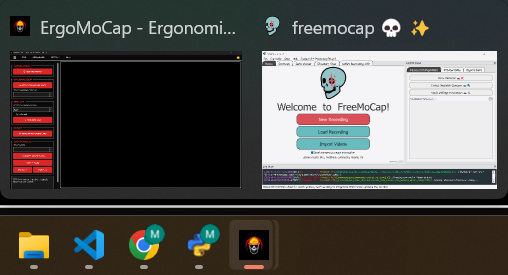

After opening, FreeMoCap will display some pop-up dialogs like the "tutorial" one in the screenshot below

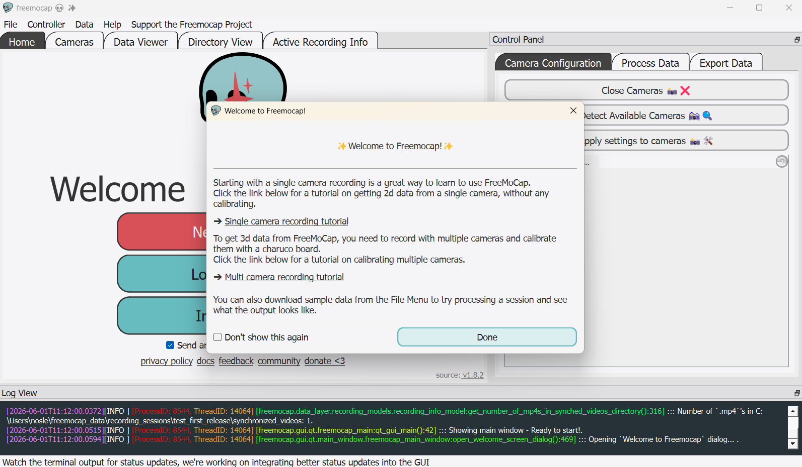

Click **Done** if you want to skip the tutorials

IMPORTANT! We strongly recommend watching the FreeMoCap Tutorial to avoid video recording artifacts and poor data collection.

### OpenCV Conflict Warning

During the first launch or environment check, FreeMoCap may display a prompt asking to resolve an **OpenCV conflict**.

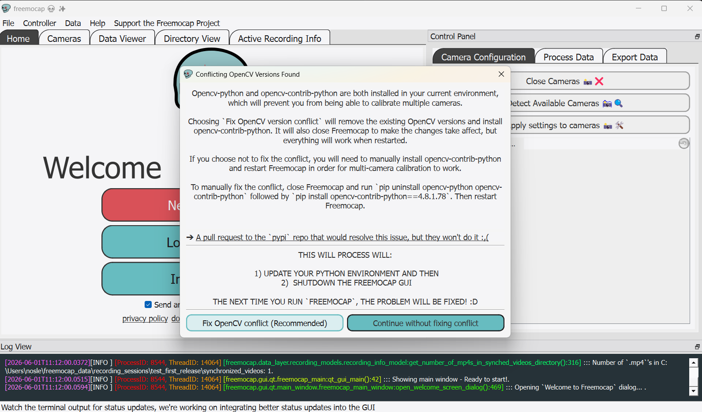

That means that in the python environment in use there is some conflict, usually between `opencv-python` and `opencv-contrib-python`

* **Action Required:** Select **Continue without fixing conflicts** if you don't need calibration. Select **Fix OpenCV conflicts (Recommended)** if you need multi-camera tracking and calibration (**Recommended**).
* **NOTE:** Allowing the program to modify or resolve this conflict can cause compatibility issues, software crashes, or unpredictable application behavior, as of v0.0.1, it has not been tested.

## Step 2: Configuring the Root Data Folder

FreeMoCap manages data within a dedicated directory. By default, it creates and uses the following path:
`C:\Users\<Your_Username>\freemocap_data`

1. Open the **Directory View** tab in FreeMoCap to see the current session directory and freemocap_data folder.

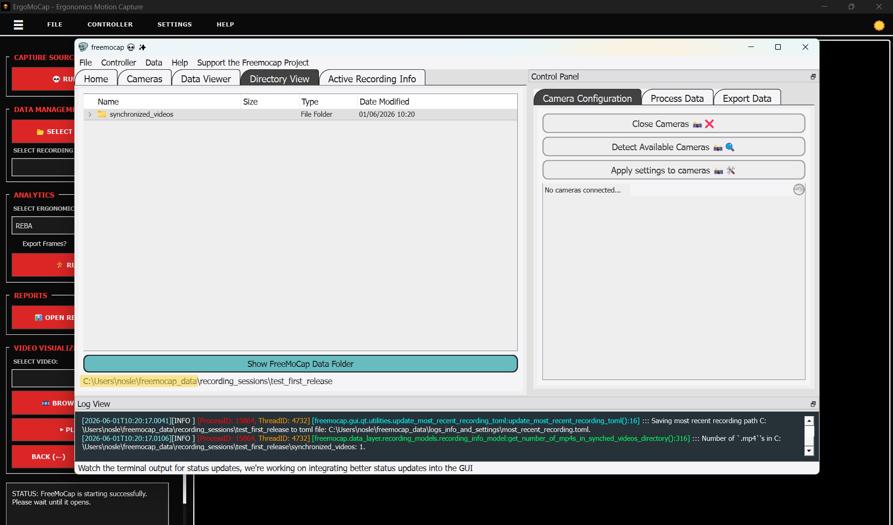

2. Click on **Show FreeMoCap Data Folder** to show the current freemocap_data folder in use with all the subfolders, in particular the `freemocap_data\recording_sessions\` which contains all the recording session folders with motion capture data processed by freemocap and then used by ergomocap.

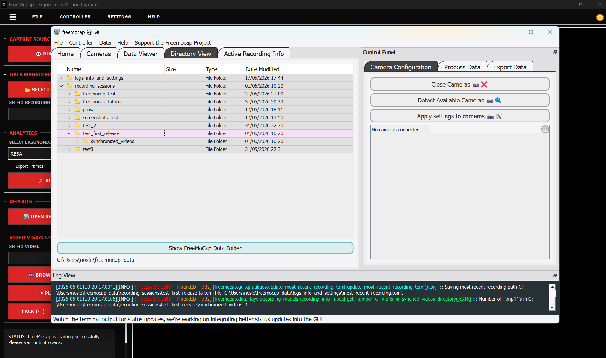

NOTE: You can select a different folder for FreeMoCap Data. Under Main Menu -> File -> Set FreeMoCap Data Folder Location or by pressing Ctrl+S. We recommend keeping the initial location to avoid unexpected behaviors.

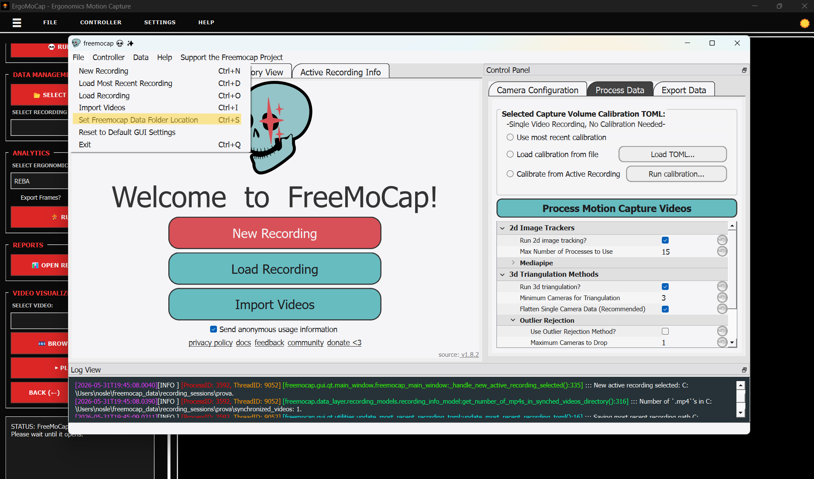

To ensure seamless data exchange between both applications:

1. Go back to the ErgoMoCap window.
2. Under the **Data Management** section, click **📁 SELECT FREEMOCAP ROOT**. [Look at the full tutorial](tutorial.md)
3. Target and select the exact same `freemocap_data` folder used by FreeMoCap. (The one shown in the 2.2 screenshot)

Keeping these paths identical ensures ErgoMoCap can find and analyze the recording sessions generated by FreeMoCap.

## Step 3: Importing Videos

Once the FreeMoCap window is open and the "Welcome to FreeMoCap!" dialog appears, you can begin loading your video data.

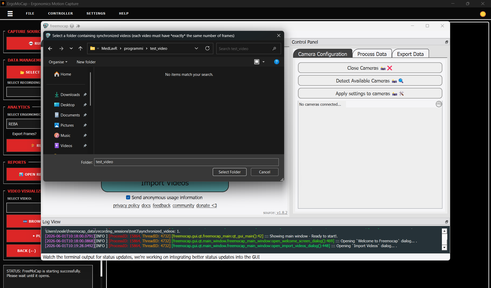

1. Click the **Import Videos** button to open the File Dialog to select the video folder.
2. **Select the Target Folder:** FreeMoCap processes data by folders, not by individual files. Each folder represents a distinct scene.
* If you are doing a **Multi-Camera / Multi-Perspective** recording, select the folder containing all the synchronized video files for that session.
* If you are using a **Single-Camera** setup, you must still select the *folder* that contains your single video file, rather than selecting the video file itself.

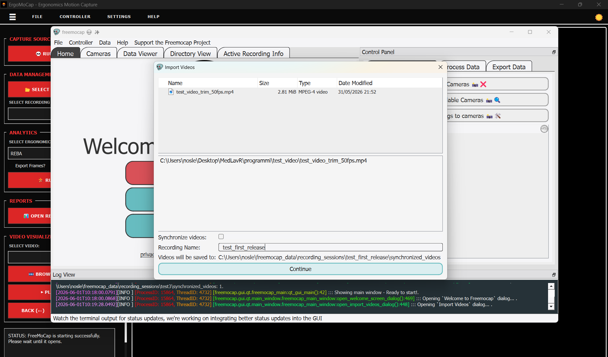

3. **Configure Import Settings:**
* **Recording Name:** Assign a clear, identifiable name to your session (for example: `test_first_release`). FreeMoCap will use this name to create a dedicated subfolder inside your `freemocap_data\recording_sessions\` directory.
* **Synchronize Videos Checkbox:** If you are importing a single video file, ensure the **Synchronize videos** checkbox is left **unchecked**.

4. Click **Continue** to finalize the import process.

## Step 4: Verification and System Prerequisites

Before initiating the tracking analysis, verify your imported files and ensure your environment meets the essential software requirements.

### Directory and Active Recording Verification

1. Navigate to the **Directory View** tab within FreeMoCap.
2. Confirm that your session folder (e.g., `test_first_release`) has been successfully created and contains a `synchronized_videos` subfolder with your video files inside.

3. If you need to verify the absolute directory path on your local storage, click the **Show FreeMoCap Data Folder** button to launch your system's file explorer directly inside the active data root.

4. Open the **Active Recording Info** tab. This dashboard presents a structural checklist of your current session data (such as the presence of 2D data, 3D data, and calibration configurations) using True/False status flags.

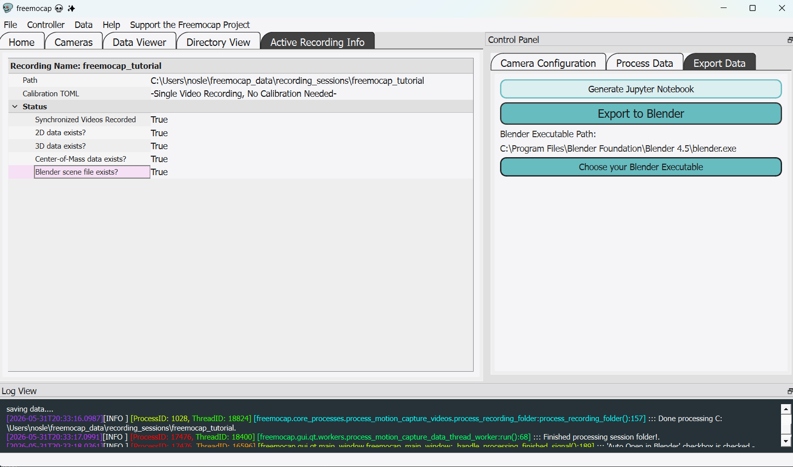

### Critical Prerequisite: Blender Installation

> ⚠️ CRITICAL NOTE!
>For ErgoMoCap to perform a complete assessment, specifically the joint angles analysis, **Blender must be installed on your system.** This is a core hardware-software dependency for version v0.0.1. Without Blender, the tracking pipeline cannot generate the necessary dataset.

* Download the software directly from the official repository: [Blender Official Website](https://www.blender.org/) or [Download Blender Release Setup](https://www.blender.org/download/).
* Once installed, switch to the **Export Data** tab in the right-hand Control Panel of FreeMoCap.
* Look at the **Blender Executable Path** field. Ensure that this file path matches the exact location of your local Blender installation (for example: `C:\Program Files\Blender Foundation\Blender 4.5\blender.exe`). If it is incorrect, click **Choose your Blender Executable** to manually target the correct file.

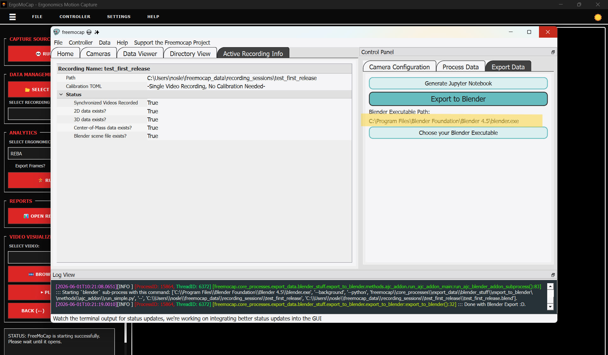

## Step 5: Data Processing and Skeleton Generation

With your video files imported and your Blender execution path verified, you can now run the motion capture extraction pipeline.

### Configuring and Running the Pipeline

1. Locate the right-hand Control Panel in FreeMoCap and click on the **Process Data** tab.

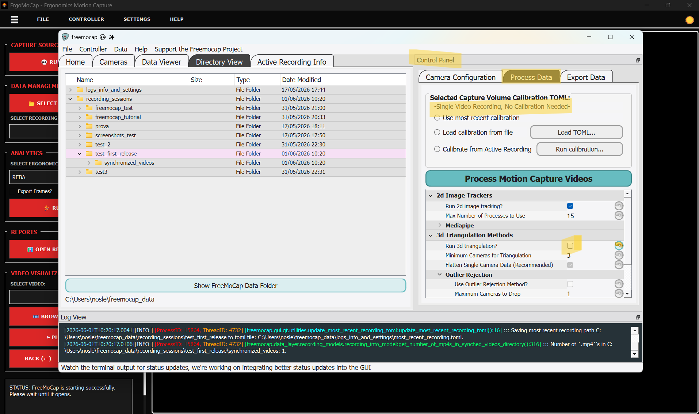

2. Review your data parameters (such as bounding configurations, YOLO cropping, or Butterworth filtering settings).
3. **Single Video Configuration:** If you are analyzing a single camera viewpoint, ensure you review the **3D Triangulation Methods** panel and adjust the parameters accordingly (such as utilizing the *Flatten Single Camera Data* recommendation).
4. Click the large green **Process Motion Capture Videos** button to start the execution.
5. The tracking processes will write status updates dynamically inside the lower **Log View** window as the 2D tracking pipelines execute.

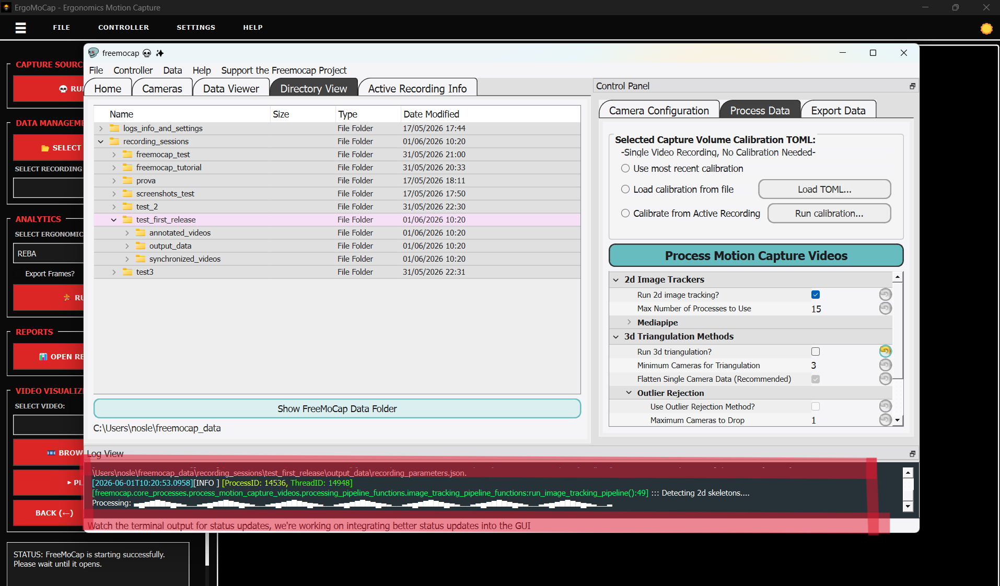

### Automated Blender Integration

During the data processing cycle, the application will automatically launch separate system terminal (cmd) windows to pass the tracked data into Blender.

1. A background Blender instance will open to compile and generate the 3D scene data file. Do not manually close these terminal spaces prematurely!

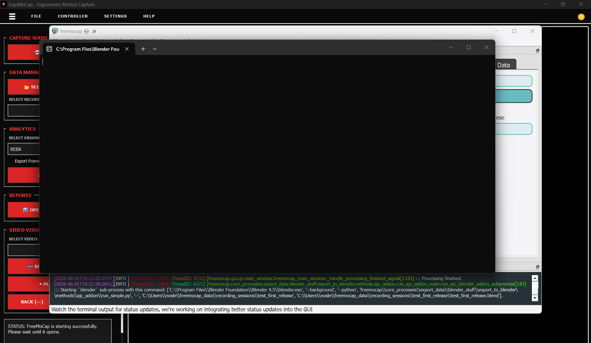

*Blender will open automatically, displaying the generated Blender file and MoCap skeleton.*

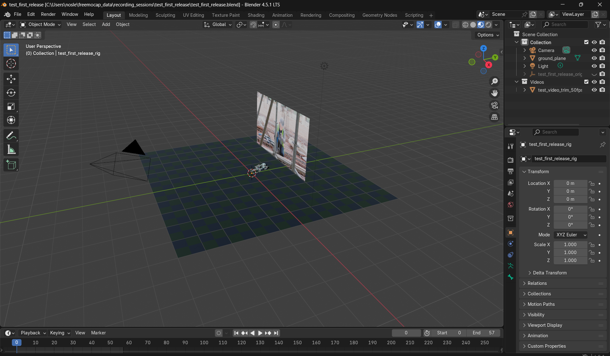

2. Once the computational script completes its task, the **Log View** at the bottom of the FreeMoCap interface will output the confirmation message: `::: Done with Blender Export :D`. As highlighted in the screenshot below

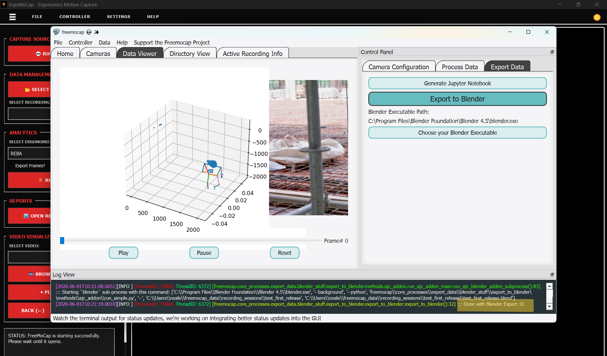

3. After this log message appears, you can safely close the open Blender window.

### Final Data Validation

To ensure that the workflow completed successfully without errors, execute these three post-processing checks:

* **Visualize the Skeleton:** Switch to the **Data Viewer** tab in the main panel. Click **Play** to check the generated 3D skeleton animation and ensure the tracking coordinates align accurately with your target movement.

* **Verify Status Compliance:** Return to the **Active Recording Info** tab. Ensure that all data parameters including *2D data exists?*, *3D data exists?*, *Center-of-Mass data exists?*, and *Blender scene file exists?* have converted to a **True** status.

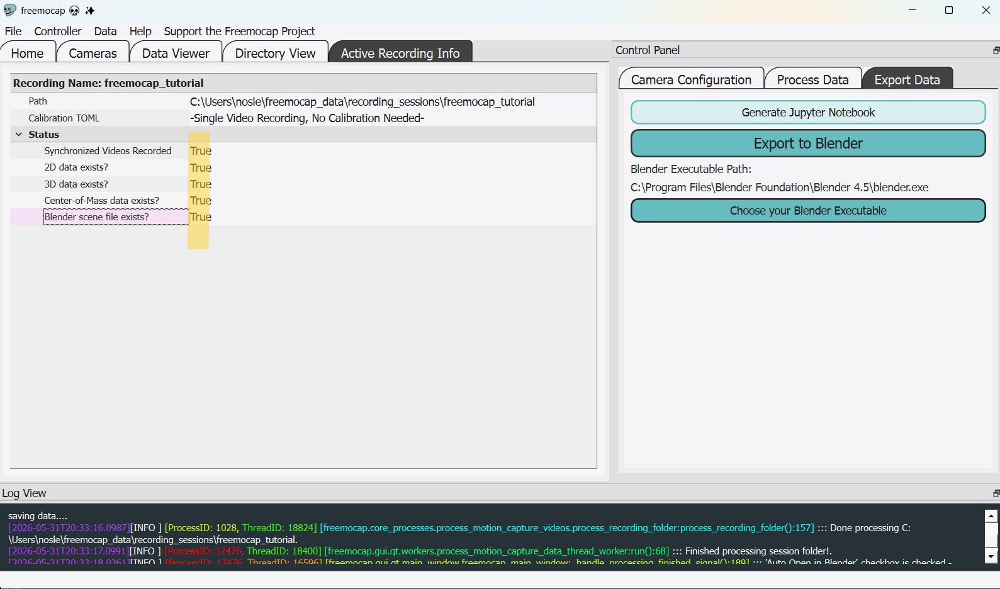

* **Confirm CSV Generation:** Open the **Directory View** tab and expand your active session folder. Verify that the system has successfully generated the spreadsheet file named `joint_angles.csv`.

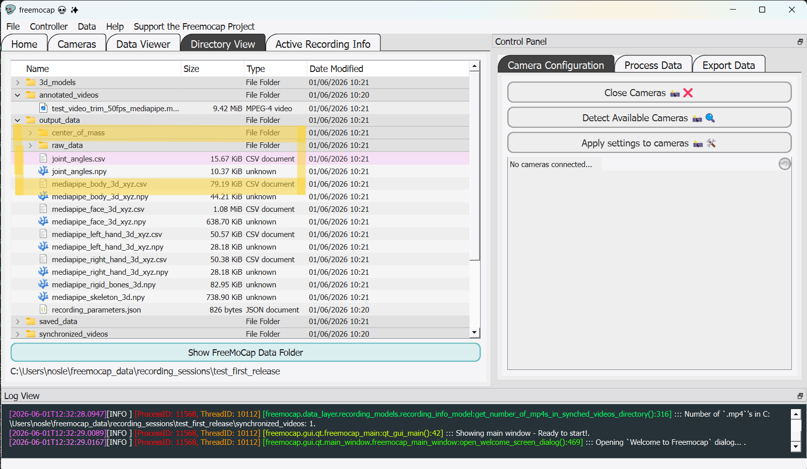

> **Important:** The `joint_angles.csv` file contains the processed coordinate metrics that ErgoMoCap reads. This file must be present in the folder structure for ErgoMoCap to successfully run its subsequent ergonomic safety algorithms.

## Step 6: Closing FreeMoCap and Returning to ErgoMoCap

Once the processing pipeline is fully complete and you have verified the generation of your `joint_angles.csv` file, you can safely close the FreeMoCap application window.

1. Close the FreeMoCap program interface.
2. Return to the open **ErgoMoCap** application window.
3. Locate the **Data Management** section on the sidebar panel and click the **📁 SELECT FREEMOCAP ROOT** button.
4. In the file explorer selection dialog, target and select the exact same `freemocap_data` root folder utilized by FreeMoCap (the directory verified in Step 2.2).

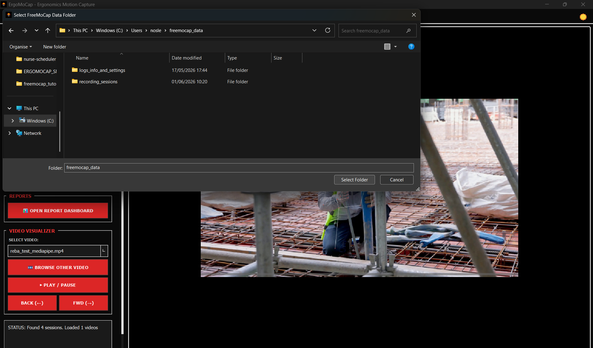

5. You can verify the correct configuration of the root folder by checking the recording session options from the **Select Recording Session** combobox.

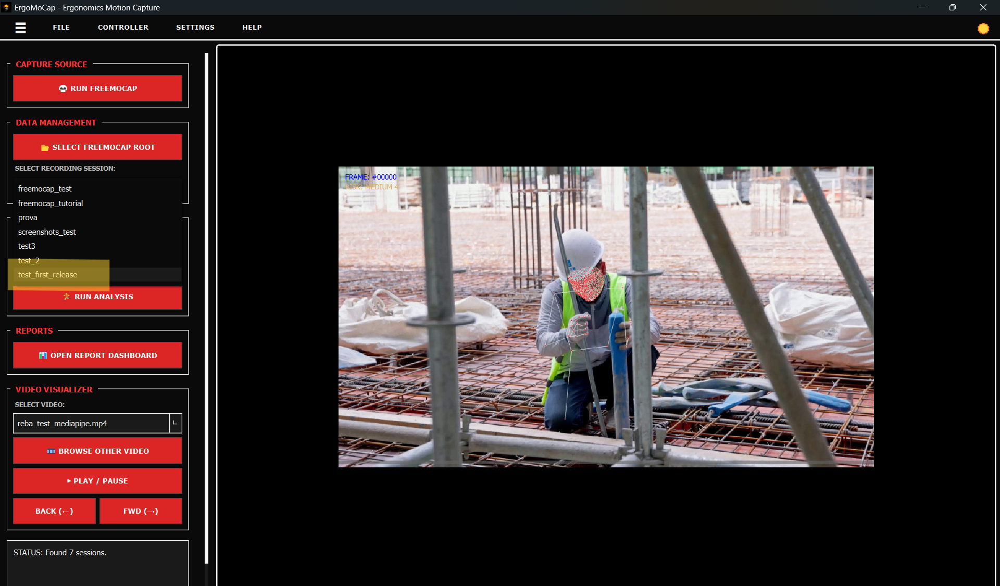

> **Note:** Keeping these database paths perfectly identical ensures that ErgoMoCap can successfully locate, parse, and analyze the tracking datasets and recording sessions generated by your FreeMoCap pipeline.

---

### Next Steps

Now that your raw video data has been successfully converted into joint coordinate tracking metrics, you are ready to execute the automated ergonomic assessment algorithms.

Continue the pipeline process by following the [ErgoMoCap Tutorial](tutorial.md).