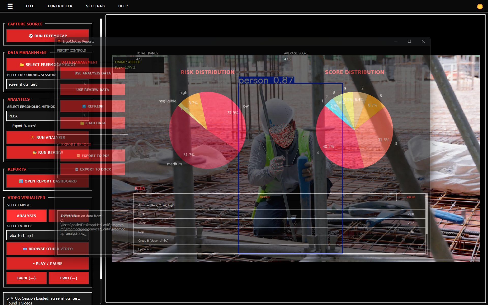
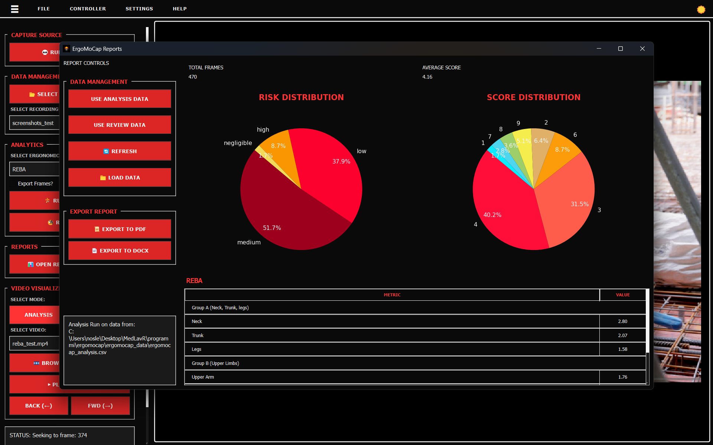
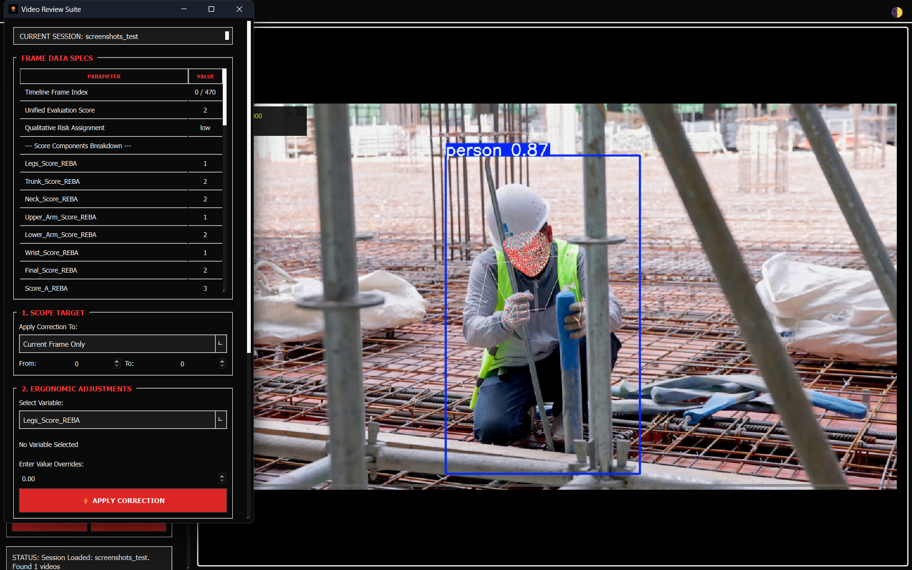

# ErgoMoCap Tutorial: How to run your first Ergo assessment

Follow these steps to check the ergonomics of a lifting task using the REBA method.

>
>IMPORTANT! You must have already all the FreeMoCap data of a recording session.
>
>If you don't have an existing recording session click on the **💀 RUN FREEMOCAP** button to open the FreeMoCap software so you can record a new session.
>
>If you don't know how to use FreeMoCap you can read a guick guide here: [Simple FMC tutorial](freemocap_tutorial.md) or read the full detailed official docs [FreeMoCap Documentation](https://docs.freemocap.org/documentation/index_md.html).
>

### Step 1: Get your data in

1. Open the app.
2. Click **📂 SELECT FREEMOCAP ROOT** and pick the folder where you keep all your recordings. IMPORTANT NOTE: Select the main 'freemocap_data' folder created by your FreeMoCap installation or the one you are using with freemocap.

3. Use the **Select Recording Session** list to pick the specific folder you want to study.

4. From the **Select Video** list, pick a file. You should see the video and the skeleton appear on the right.

### Step 2: Choose your method

1. Go to the **Select Ergonomic Method** list.
2. Pick **REBA** (or RULA if you are just looking at upper body).

3. Click **🏃 RUN ANALYSIS**. Wait for the status bar at the bottom to say it's finished.

>NOTE: Video playback will stutter while an analysis is running. We recommend waiting for the calculation to finish before playing the video.

*The status bar will show a confirmation message when the processing finishes:*

### Step 3: Check the video

1. Click **▶ PLAY / PAUSE**.
2. Watch the video to make sure the skeleton is actually on top of the person.

3. If the skeleton is jumping around or "shaky," you might need better lighting or a different camera angle next time.
4. * **SELECT MODE (ANALYSIS / REVIEW)**: Toggle between these buttons to switch which score overlay is displayed on top of the video canvas (raw analysis data vs your manual review revisions) see Step 5 for more info about the review mode.

### Step 4: See the results and save

1. Click **📊 OPEN REPORT DASHBOARD**. A new window will pop up.
2. Look at the **Risk Pie Charts** to see if the person spent too much time in the "High Risk" (red) zones.

3. If you need a file for your records:
   - Click **📜 EXPORT TO PDF** for a clean shareable report.
   - Click **📄 EXPORT TO DOCX** if you need a Word file you can type in later.

### Step 5: Review the results

1. Click **🧐 RUN REVIEW** to  show the floating widget "Video Review Suite"
2. Review current frame data in the "Frame Data Specs" section (scores and kinematic variablesa)

This table is read only, to change the values and apply corrections follow the next instructions.

3. In the "1. Scope Target" section select the scope you want to apply the changes from the "Apply Correction to" combobox (Current Frame Only, Custom Frame Range, Entire Recording Timeline). If you select "Custom Frame Range" you MUST input the first and last frame index in the 2 numbers inputs below ("From" and "To")

4. Select the variable you want to overwrite from the "Select Variable" combobox in the "2. Ergonomic Adjustments" section, and enter the correct value in the "Enter Adjusted Value Overrides" input.

5. Click **⚡ APPLY CORRECTION** to overwrite the values and apply the changes. NOTE: the changes are applied to the runtime dataframe, and are not saved until you commit the revision clicking the button (see last point)

6. You can add a note in the "3. Operator Observations" section

7. Click the **💾 COMMIT REVISIONS** button to save the applied changes to the new ergomocap_review.csv file (saved in ergomocap_data folder)

---

### 💡 Tips for better results

* **Use FreeMoCap Calibration**: FreeMoCap provides a built-in calibration tool that uses ChArUco boards, using it improves accuracy of MoCap data collection.
* **Clear view**: Make sure no boxes or chairs are blocking the camera's view of the person's joints. If the camera can't see the knees or elbows, the score will be wrong.
* **Lighting**: If the room is too dark, the tracking will be "noisy" (the skeleton will twitch).
* **Double Check**: Computers make mistakes. Always look at the video yourself to see if a "High Risk" score actually looks like a dangerous movement.

For better detailed info about Video Recording, Calibration with ChArUco boards and MoCap data collection you can read the official [FreeMoCap Documentation](https://docs.freemocap.org/documentation/index_md.html).

---

© 2026 medlav. Distributed under the AGPL-3.0 License.