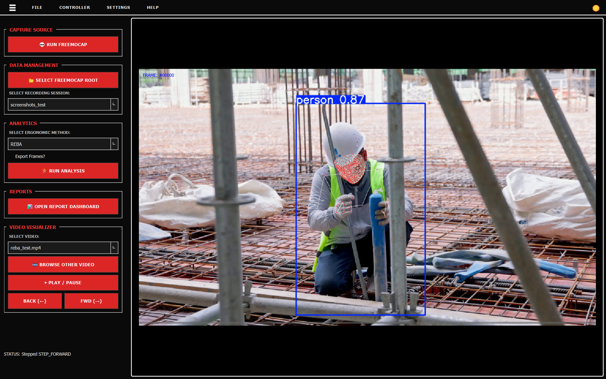
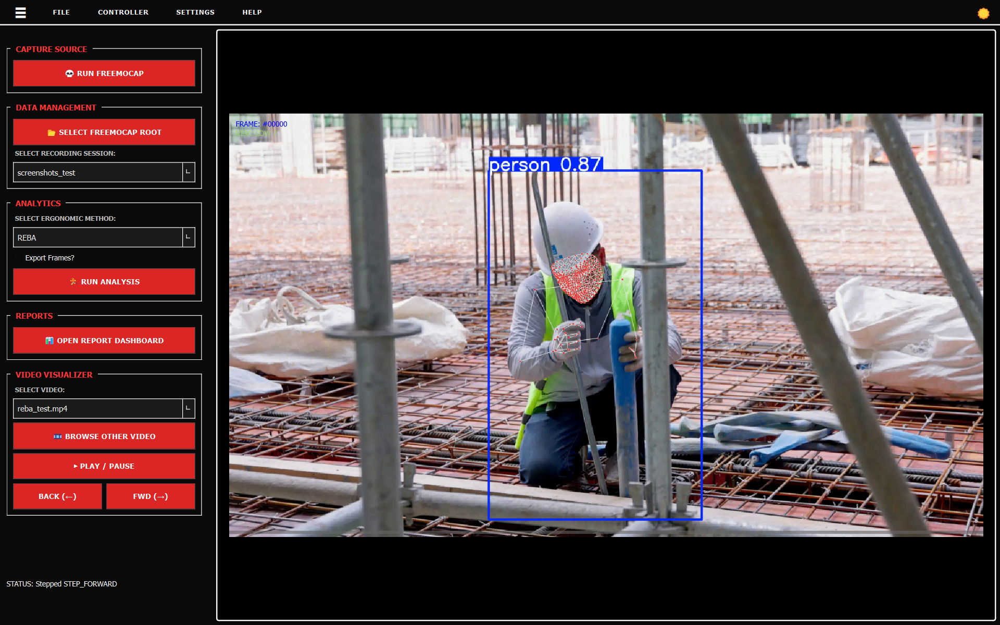
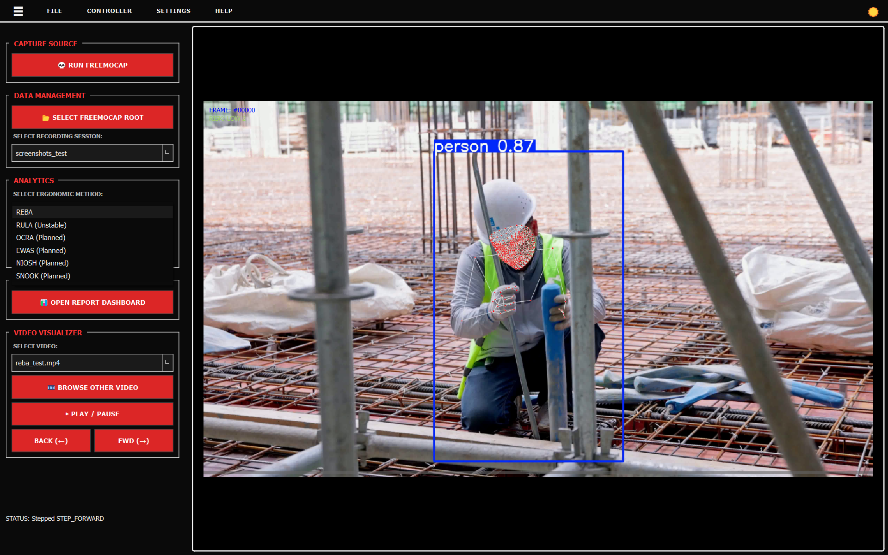
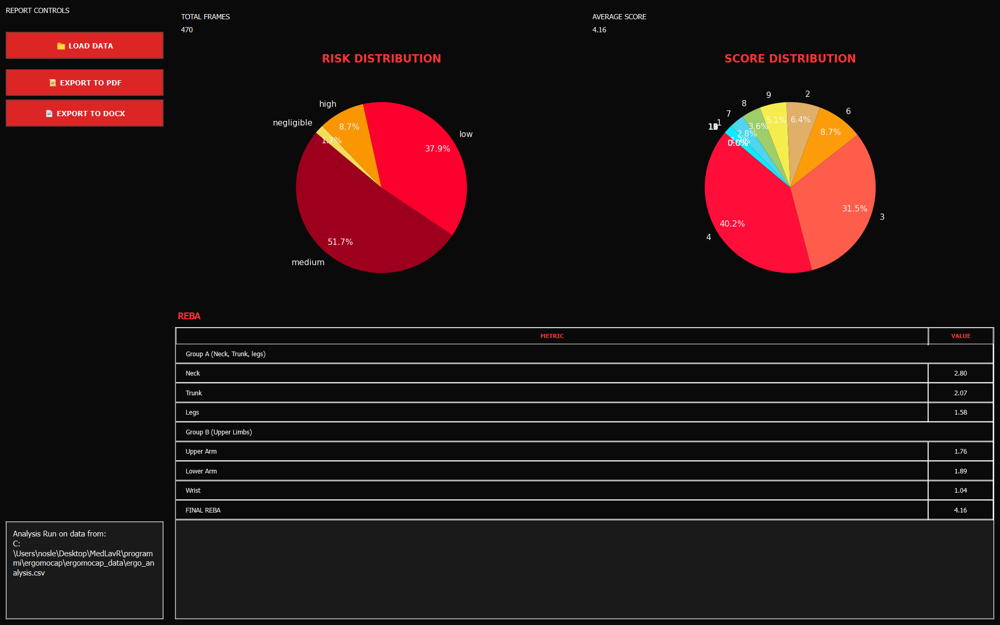
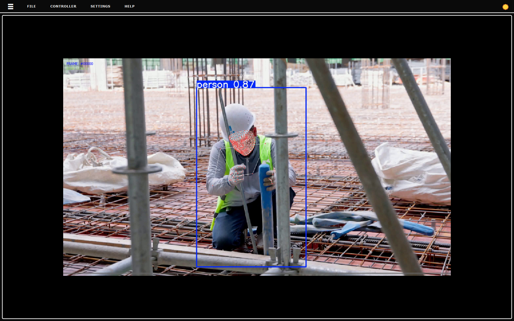
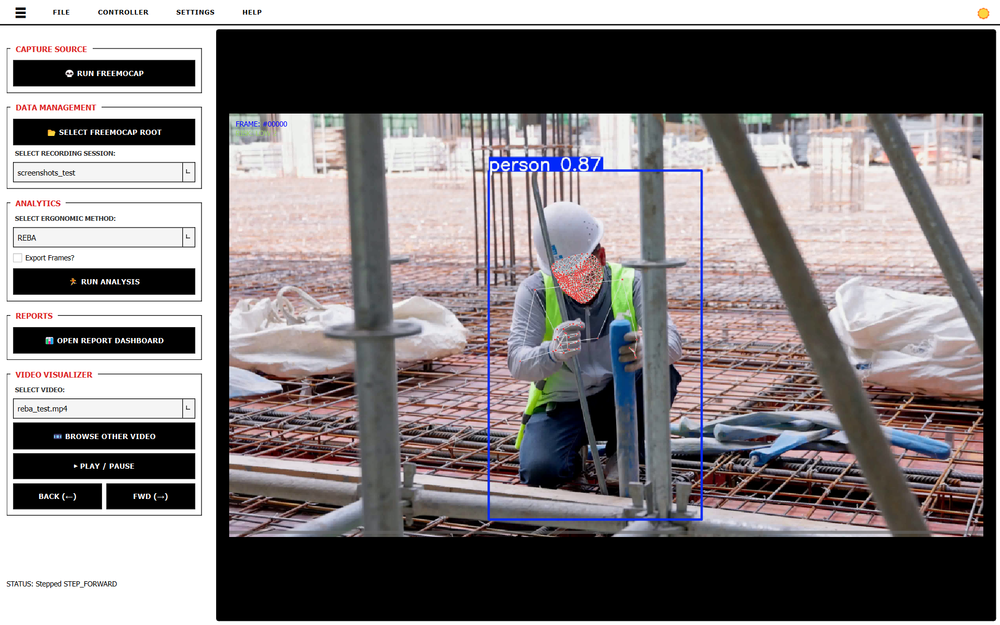
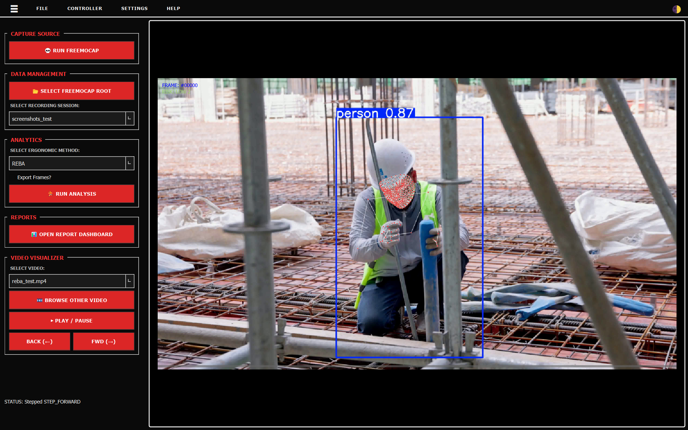

# ErgoMoCap User Guide

ErgoMoCap is a tool that takes 3D motion data and turns it into ergonomic scores. It has two parts: the **Main Window** (where you do the work) and the **Report Dashboard** (where you look at the results).

>NOTE
>
>For specific and detailed info about Video Recording, Calibration with ChArUco boards and MoCap data collection you can read the official [FreeMoCap Documentation](https://docs.freemocap.org/documentation/index_md.html)

---

## 1. Main Window
This is where you load your files and run the calculations.

### 📁 Files & Recording

* **💀 RUN FREEMOCAP**: Opens the FreeMoCap software so you can record a new session.
* **📂 SELECT FREEMOCAP ROOT**: Tell the app which folder contains all your recordings.
* **Select Recording Session**: Pick the specific folder (e.g., `session_001`) you want to look at.

### 🏃 Analysis

Pick a method from the list.

* **Working**: REBA, RULA.
* **Coming Soon**: OCRA, NIOSH, SNOOK, MAPO.

Click **🏃 RUN ANALYSIS** to calculate the joint angles and save the results to a file.

### 🎞️ Video Player

* **Select Video**: Pick a video from the current session.
* **▶ PLAY / PAUSE**: Start or stop the video to see the skeleton overlay.
* **🎞️ BROWSE OTHER VIDEO**: If your video isn't in the session folder, find it manually here.

---

## 2. Report Dashboard

Click **📊 OPEN REPORT DASHBOARD** to see the data breakdown.

### 📈 Numbers & Charts

The app calculates these automatically:

* **TOTAL FRAMES**: How many frames were in the recording.
* **AVG REBA SCORE**: The average score for the whole session.
* **Risk Pie Charts**: Shows how much time was spent in "Safe" vs "Danger" zones.
* **Score Table**: Shows the specific scores for **Trunk, Neck, Legs, Arms, and Wrists**.

### 💾 Saving Reports

1. **📁 LOAD DATA**: Open an analysis file you made earlier (.csv or .xlsx).
2. **📜 EXPORT TO PDF**: Saves a PDF version of the report.
3. **📄 EXPORT TO DOCX**: Saves a Word document you can edit.

---

## Settings

* **Sidebar**: Click ☰ to hide the left menu and make the video/charts bigger.

* **Theme**: Click ☀️/🌓 to switch between Dark and Light mode.

* **Language**: Switch between English and Italian. (Planned still not working on v0.0.1)

---

## ⚠️ Status Bar

Check the **STATUS** text at the bottom left. It tells you:

* If your file loaded correctly.
* How many sessions were found.
* If the video is playing or paused.
* If the analysis finished.

---

© 2026 medlav. Distributed under the AGPL-3.0 License.